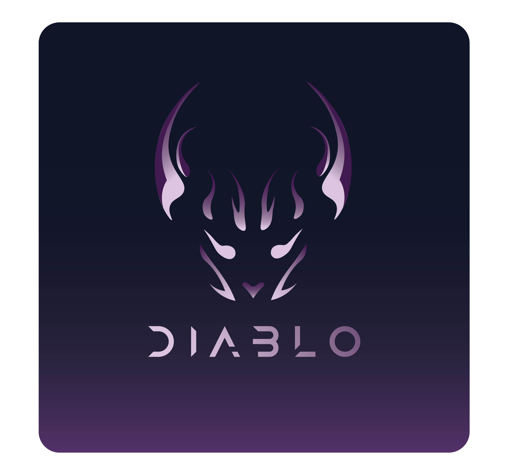

# diablo

  

diablo is an Out-Of-Order 64-bit RISC-V processor. 

> [!NOTE]
> **Project Status:** This project is currently undergoing a complete reimplementation from SystemVerilog to **Spade HDL** to leverage modern build tools (Cargo/swim) and first-class hardware pipelines.

## Goal

- Implement an Out-Of-Order pipeline (Fetch, Decode, Rename, Issue, Execute, Commit) using Spade.
- Run instructions out-of-order after resolving data dependencies.
- Boot Linux in a Verilator simulation.
- Serve as a testbed for new microarchitecture projects.

## Legacy Code

The original SystemVerilog single-cycle and partial OoO implementations have been archived to the `legacy/` directory.
